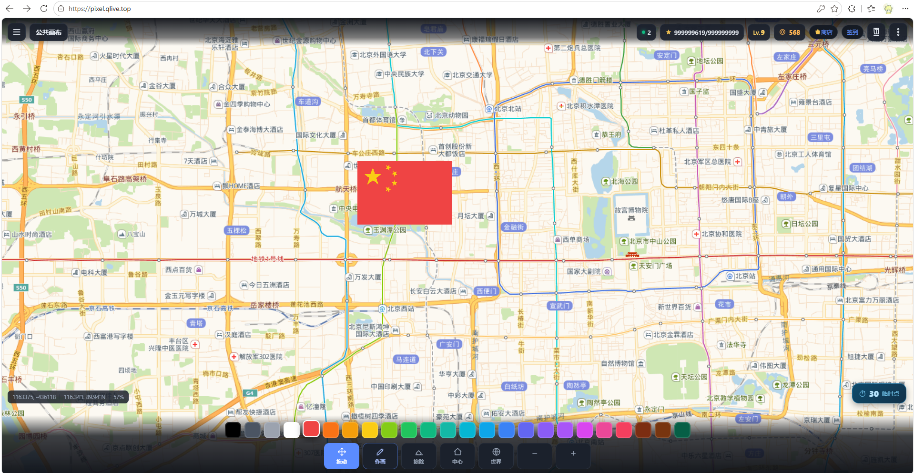

<div align="center">

**Language / 语言:** [🇺🇸 English](README_EN.md) · [🇨🇳 中文](README.md)

</div>

# PixelVerse‑Wplace

> A multiplayer online pixel‑drawing web app inspired by wplace, recreating the large‑scale collaborative canvas experience. Supports multiple people drawing pixels together in real time. Entirely developed by AI.


> This is a test image; the actual result may vary.

## Live Demo

http://pixel.qlive.top

This is a small home server — please do not stress‑test it QWQ

---

## 📖 Introduction

PixelVerse is a multiplayer online pixel‑canvas project inspired by Wplace / Reddit r/place.
It supports a multi‑room mode where many people can freely place pixel blocks on the canvas and have everyone's drawing actions synchronized in real time to co‑create pixel art.

- ✨ **Multi‑room, real‑time multiplayer drawing**, with support for creating your own rooms
- 📈 A complete leveling system; leveling up unlocks a higher pixel‑point cap
- 🏆 A leaderboard in the top‑right corner, showing the top 10 contributors
- 🎁 A daily check‑in system that grants pixel coins and pixel points
- 🛒 A built‑in shop where pixel coins are spent on various items
- 🖼️ A huge canvas for freeform drawing
- 🚀 A lightweight Node.js + MySQL backend; simple and fast to deploy
- 📦 Out of the box: a built‑in web install wizard — fill in a form on first launch to complete database and admin setup
- 🔧 Email sending settings are moved into the admin panel, so no config‑file editing is needed

---

## 🎮 How to Play

> A new pixel point is added every 10 seconds — you get them just by staying online (idle)
>
> ⚠️ Do not draw anything illegal or against regulations. If违规 content appears, we will cooperate with law enforcement when necessary.

### 🏠 Room System

Supports multiple rooms for real‑time multiplayer drawing; players can create their own rooms. **Creating a room consumes a "Room Card" (开房卡).**

### 📊 Levels & Pixel‑Point System

The maximum level is **9**. Pixel points accumulate to raise your level, and a higher level means a higher pixel‑point cap. Each level‑up grants a coin reward that is +20 over the previous level.

| Level | Cumulative pixels to level up | Pixel‑point cap | Coin reward on level‑up |
|---|---|---|---|
| 1 | Initial | 60 | None |
| 2 | 50 | 75 | 100 |
| 3 | 100 | 95 | 120 |
| 4 | 300 | 120 | 140 |
| 5 | 600 | 150 | 160 |
| 6 | 1200 | 185 | 180 |
| 7 | 2400 | 215 | 200 |
| 8 | 4800 | 260 | 220 |
| 9 | 8000 | 300 | 240 |

### 🏆 Leaderboard

A leaderboard panel is built into the top‑right corner, showing the top 10 users by number of pixels drawn.

### 📅 Daily Check‑in

A check‑in button in the top‑right corner — **can only be used once per day**

- Random reward: 20‑50 pixel coins
- Random reward: 20‑30 pixel points

### 🛒 Shop System

A shop button in the top‑right corner opens the shop, where pixel coins are exchanged for items:

1. Pixel‑point cap: `1 coin = 1 point cap`
2. Temporary pixel points: `1 coin = 10 temporary points`
3. Room Card: `1000 coins`, used to create a new room

---

## 🛠️ Requirements

| Dependency | Version | Notes |
|---|---|---|
| Node.js | v20.20.2 recommended | v18+ also works |
| MySQL | 8.0 recommended | Required, for storing canvas / users / rooms etc. |
| npm | Bundled with Node | For installing dependencies |

> ⚠️ This project **requires MySQL**. If you use MySQL 8.0, the account used by the install wizard must have `CREATE DATABASE` permission (e.g. `root`). A regular business account (e.g. `qypixel`) usually lacks database‑creation rights and cannot be used for first‑time installation.

---

## 📥 Installation & Deployment

### 1. Clone the code

```bash
git clone https://github.com/2692643871/PixelVerse---Wplace-.git
cd PixelVerse---Wplace
```

### 2. Install dependencies

```bash
npm install
```

### 3. Prepare a database account

Make sure you have an accessible MySQL service and prepare an account **with database‑creation permission** (the first‑time install wizard will use it to automatically create the database and tables).

- The database name, account, and password are filled in during the install wizard — you do NOT need to create the database manually in advance.
- If you are only connecting to an existing database, make sure the account has full privileges on the target database.

### 4. Start the service (enter the install wizard)

**Do NOT** pre‑create `.env`, and **do NOT** configure the database connection manually — just start the service and let the web wizard handle initialization:

```bash
node server.js
```

On success, the service listens on the default port `3000` (changeable at the top of `server.js` or in `.env`).

### 5. Web install wizard (required on first run)

Open the install wizard in your browser:

```
http://YOUR_SERVER_IP:3000/install.html
```

> If you visit `/` or `/admin/` directly before installation is finished, it will automatically redirect to the install page.

On the install page, fill in:

| Field | Notes |
|---|---|
| Database host | Usually `127.0.0.1` |
| Database port | Usually `3306` |
| Database name | Custom, e.g. `qypixel` |
| Database account | An account with database‑creation rights (e.g. `root`) |
| Database password | That account's password |
| Admin account | Account used to log into the admin panel |
| Admin password | Password used to log into the admin panel |

After clicking "Start Install", the system will:

1. Connect using the MySQL account you provided and automatically **CREATE DATABASE**;
2. Create all tables (users, rooms, canvas pixels, draw logs, shop transactions, settings, etc.);
3. Write the admin account;
4. Automatically generate `.env` (with `INSTALLED=1`);
5. Redirect to the admin login page.

> 💡 To run the install wizard again later, simply delete the `.env` file in the project root (or remove the `INSTALLED=1` line from it) and restart the service.

### 6. Access the web app

```
http://YOUR_SERVER_IP:3000
```

This enters the pixel‑drawing canvas. The admin panel address is:

```
http://YOUR_SERVER_IP:3000/admin/
```

### 7. Email sending settings (for verification‑code registration)

After logging into the admin panel, go to **Global Settings → Email Settings** and fill in:

- Sending email account (QQ email, e.g. `123@qq.com`)
- SMTP authorization code (QQ email's SMTP authorization code, NOT the login password)

After filling in, **click "Save Email Settings" first, then click "Send Test Email"** to verify that verification emails can be sent normally.
This configuration is stored in the database `settings` table and read dynamically at runtime — no config‑file editing or service restart required.

---

## 📁 Project Structure

```
PixelVerse---Wplace
├─ public/                 # Front-end files
│  ├─ index.html           # Drawing home page (canvas, leaderboard, shop, check-in)
│  ├─ app.js               # Front-end main logic
│  ├─ world.js             # Canvas rendering
│  ├─ style.css            # Styles
│  ├─ install.html         # Web install wizard (for first-time deployment)
│  └─ admin/
│     └─ index.html        # Admin panel page
├─ data/                   # Local data directory (if any)
├─ deploy-baota.md         # Baota panel deployment guide
├─ BT-PM2-GUIDE.md         # PM2 deployment reference
├─ deploy.sh               # Deployment script
├─ ecosystem.config.js     # PM2 configuration
├─ .env.example            # Environment variable example (can be left blank; generated by wizard)
├─ db.js                   # Database initialization & queries
├─ server.js               # Service entry point
├─ package.json
├─ LICENSE
└─ README.md
```

---

## 🚀 Server Deployment

### Method 1: Run directly (foreground / background)

```bash
node server.js
```

Run persistently in the background (Linux, survives SSH disconnect):

```bash
nohup node server.js > server.log 2>&1 &
```

### Method 2: PM2 daemon (recommended for production)

```bash
# Install pm2 (if not already installed)
npm install pm2 -g

# Start with the project's bundled config (eco.config is pre-configured)
pm2 start ecosystem.config.js

# Enable startup on boot
pm2 startup
pm2 save
```

Common commands:

```bash
pm2 ls          # List processes
pm2 logs        # View logs
pm2 restart all # Restart
pm2 stop all    # Stop
```

### Method 3: Baota panel deployment

See the guide: `deploy-baota.md`

Rough flow: Create a site in Baota → upload code → install dependencies → `node server.js` or PM2 daemon → open port / configure reverse proxy.

---

## 📝 Notes

1. **MySQL must be configured**: The project relies on MySQL for data storage; if it is not installed or the connection fails, the service will not start.
2. **First‑time install needs database‑creation rights**: The MySQL account used by the install wizard must have `CREATE DATABASE` permission (e.g. `root`).
3. **Port & firewall**: The default port is `3000`, changeable in `server.js` or `.env`; for public deployment, open the port and the relevant security group.
4. **Data persistence**: Canvas pixels, users, rooms, levels, coins, check‑ins, etc. are all stored in MySQL and will not be lost on restart.
5. **Re‑install**: Delete the `.env` in the root directory (or the `INSTALLED=1` line inside it), then restart the service to enter the install wizard again.
6. **HTTPS recommended**: For public deployment, configure a reverse proxy (Nginx / Baota) + SSL certificate for HTTPS access.
7. **Admin path changed**: The admin entry has moved from `admin.html` to the `admin/` directory; the old `admin.html` link will automatically 302‑redirect to the new address.
8. **`.env` security**: `.env` contains database and admin passwords — **do not commit it to a public repository** (already ignored by `.gitignore`).

---

## 📄 License

MIT
